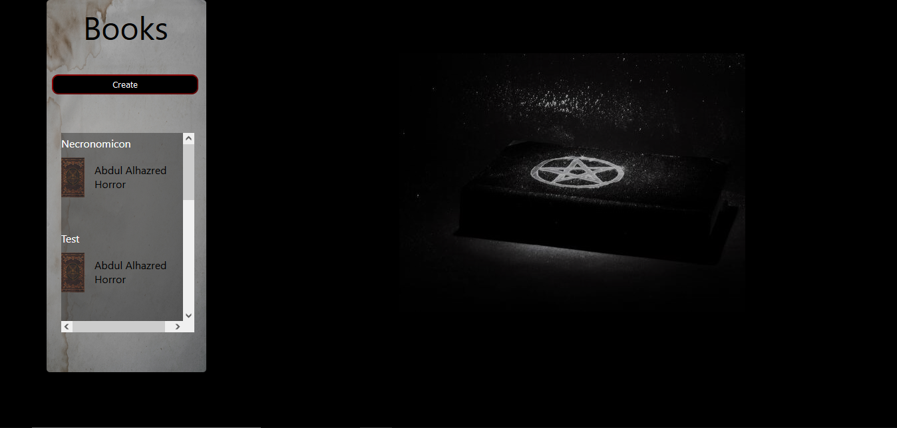
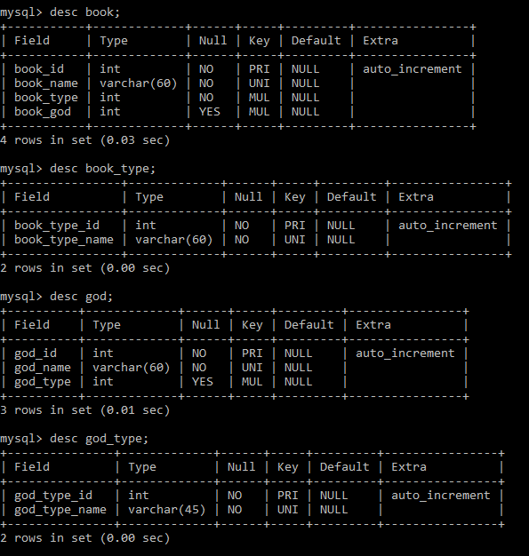

# dark-library-backend
É uma API REST de um site com o objetivo de cadastrar livros fictícios. Cada livro, como por exemplo, o Necronomicon, possui um tipo de "deus" vinculado. Tanto o livro quanto o deus possuem tipos, tendo assim uma relação um para muitos, um livro possui um tipo, um tipo possui "n" livros.

Foi usado Spring Boot e o banco de dados MySQL. Escolhi não usar JPA para este projeto por motivos didáticos, escolhi modelar o banco de dados pelo MySQL Workbench 
pra ter melhor visualização das relações.

